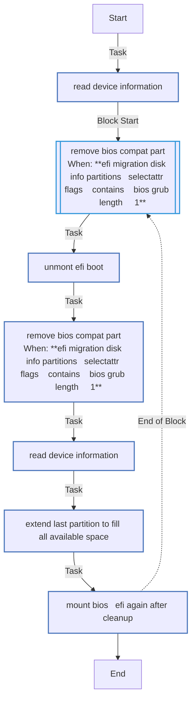
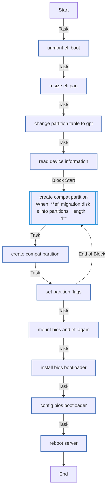
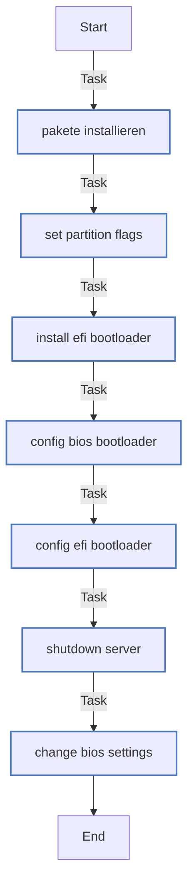
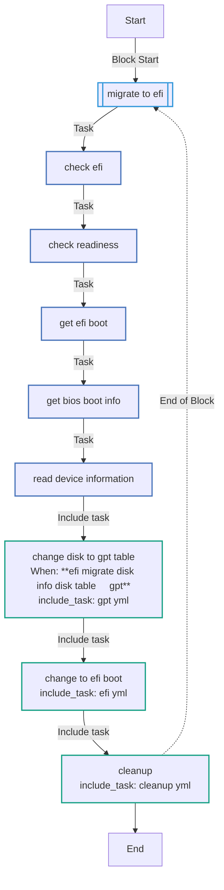

<!-- DOCSIBLE START -->

# 📃 Role overview

## ansible-efi-migrate

Description: This Role can change a Server from BIOS to EFI Boot.  
I tested it with RHEL 8 and works so far.  
Please note: this is neither supported by RedHat or by myself !! USE WITH CAUTION !! I recommend making Snapshots beforehand!

The role will check if the system is running in BIOS mode and if there are mount points for /boot and /boot/efi.  
It will then check if the disk containing /boot/efi is using a GPT partition table and if not, it will convert the disk to GPT and create a BIOS compatibility partition if needed.  
Finally, it will install the EFI bootloader and migrate the system to EFI boot mode.

<b>🧩 Argument Specifications in meta/argument_specs</b>

#### Key: main
**Description**: This is the main entry point for the role.

#### Key: cleanup
**Description**: This task file handles the migration from BIOS to EFI bootloader.

  - **efi_migration_bios_disk_part_id**
    - **Required**: True
    - **Type**: str
    - **Default**: none
    - **Description**: The partition ID of the BIOS boot partition.
  
  
  

  - **efi_migration_boot_disk_part_id**
    - **Required**: True
    - **Type**: str
    - **Default**: none
    - **Description**: The partition ID of the EFI boot partition.
  
  
  

  - **efi_migration_boot_disk**
    - **Required**: True
    - **Type**: str
    - **Default**: none
    - **Description**: The boot disk where the EFI migration will take place.
  
  
  

### Defaults

**These are static variables with lower priority**

#### File: defaults/main.yml

| Var          | Type         | Value       |
|--------------|--------------|-------------|
| [efi_migrate_reboot_msg](defaults/main.yml#L4)   | str | `{{ efi_migration_boot_disk }} changed to GPT` |    
| [efi_migrate_reboot_timeout](defaults/main.yml#L5)   | int | `120` |    

### Tasks

#### File: tasks/cleanup.yml

| Name | Module | Has Conditions |
| ---- | ------ | -------------- |
| [Read device information](tasks/cleanup.yml#L31) | community.general.parted | False |
| [Remove Bios Compat Part](tasks/cleanup.yml#L22) | block | True |
| [Unmont EFI & Boot](tasks/cleanup.yml#L12) | ansible.posix.mount | False |
| [Remove Bios Compat Part](tasks/cleanup.yml#L22) | community.general.parted | True |
| [Read device information](tasks/cleanup.yml#L31) | community.general.parted | False |
| [Extend last partition to fill all available space](tasks/cleanup.yml#L37) | community.general.parted | False |
| [Mount BIOS & EFI again after cleanup](tasks/cleanup.yml#L50) | ansible.posix.mount | False |

#### File: tasks/efi.yml

| Name | Module | Has Conditions |
| ---- | ------ | -------------- |
| [Pakete installieren](tasks/efi.yml#L3) | ansible.builtin.dnf | False |
| [Set Partition Flags](tasks/efi.yml#L14) | ansible.builtin.shell | False |
| [Install EFI Bootloader](tasks/efi.yml#L25) | ansible.builtin.shell | False |
| [Config BIOS Bootloader](tasks/efi.yml#L29) | ansible.builtin.shell | False |
| [Config EFI Bootloader](tasks/efi.yml#L33) | ansible.builtin.shell | False |
| [Shutdown Server](tasks/efi.yml#L37) | community.general.shutdown | False |
| [Change Bios Settings](tasks/efi.yml#L40) | ansible.builtin.pause | False |

#### File: tasks/gpt.yml

| Name | Module | Has Conditions | Comments |
| ---- | ------ | -------------- | -------- |
| [Unmont EFI & Boot](tasks/gpt.yml#L3) | ansible.posix.mount | False |  |
| [Resize EFI Part](tasks/gpt.yml#L11) | ansible.builtin.shell | False |  |
| [Change Partition Table to GPT](tasks/gpt.yml#L20) | ansible.builtin.shell | False |  |
| [Read device information](tasks/gpt.yml#L27) | community.general.parted | False |  |
| [Create Compat Partition](tasks/gpt.yml#L37) | block | True | You'll need this in order to boot in BIOS mode from a GPT disk |
| [Create Compat Partition](tasks/gpt.yml#L37) | ansible.builtin.shell | False | You'll need this in order to boot in BIOS mode from a GPT disk |
| [Set Partition Flags](tasks/gpt.yml#L45) | ansible.builtin.shell | False |  |
| [Mount BIOS and EFI again](tasks/gpt.yml#L57) | ansible.posix.mount | False |  |
| [Install BIOS Bootloader](tasks/gpt.yml#L70) | ansible.builtin.shell | False |  |
| [Config BIOS Bootloader](tasks/gpt.yml#L74) | ansible.builtin.shell | False |  |
| [Reboot Server](tasks/gpt.yml#L78) | ansible.builtin.reboot | False |  |

#### File: tasks/main.yml

| Name | Module | Has Conditions |
| ---- | ------ | -------------- |
| [Migrate to EFI](tasks/main.yml#L5) | block | False |
| [Check EFI](tasks/main.yml#L8) | ansible.builtin.stat | False |
| [Check Readiness](tasks/main.yml#L13) | ansible.builtin.assert | False |
| [Get EFI Boot](tasks/main.yml#L20) | ansible.builtin.set_fact | False |
| [Get BIOS Boot Info](tasks/main.yml#L32) | ansible.builtin.set_fact | False |
| [Read device information](tasks/main.yml#L44) | community.general.parted | False |
| [Change Disk to GPT Table](tasks/main.yml#L50) | ansible.builtin.include_tasks | True |
| [Change to EFI Boot](tasks/main.yml#L54) | ansible.builtin.include_tasks | False |
| [Cleanup](tasks/main.yml#L57) | ansible.builtin.include_tasks | False |

## Task Flow Graphs

### Graph for cleanup.yml

### Graph for gpt.yml

### Graph for efi.yml

### Graph for main.yml

## Author Information
Fabian Seelbach

#### License

GPL-3.0-only

#### Minimum Ansible Version

2.12

#### Platforms

- **EL**: [8]

#### Dependencies

No dependencies specified.
<!-- DOCSIBLE END -->
